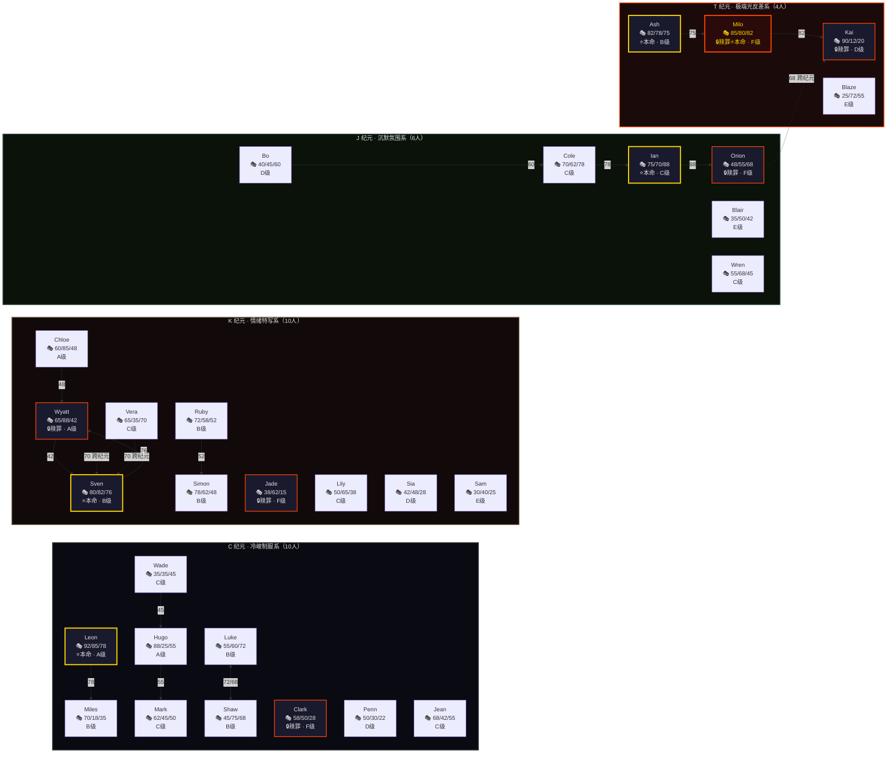
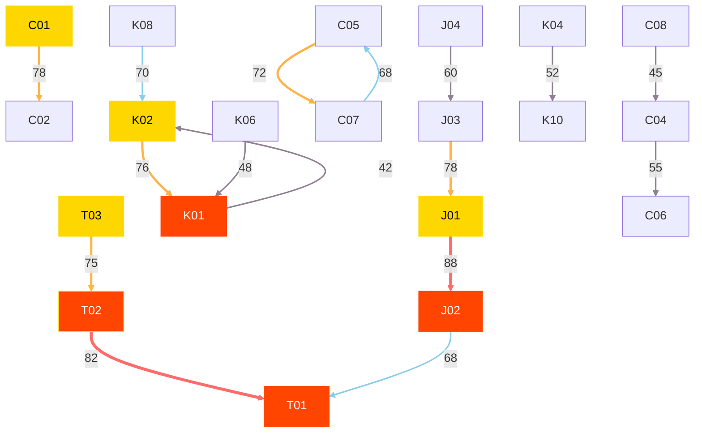
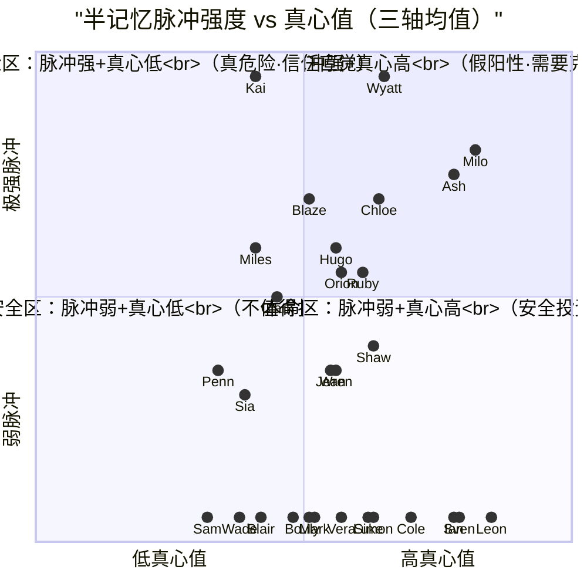

# KOF大粉模拟器 — 全30人角色关系图谱

> 以下为 Mermaid 格式的关系图，支持在 Markdown 预览器、VS Code Mermaid 插件、或 [Mermaid Live Editor](https://mermaid.live) 中渲染。

---

## 图谱 1：CP 关系全览（按纪元分区）

---

## 图谱 2：CP 强度热力图（仅关系，按强度排序）

---

## 图谱 3：半记忆脉冲 × 真心值象限图

---

## 图例说明

| 标记 | 含义 |
|------|------|
| 🎙️ 三轴值 | 舞台热忱 / 粉丝回馈 / CP羁绊 |
| ⭐ | 本命候选（三轴全 > 60） |
| 🔒 | 堕落赎罪者（F级起步 · 加倍练习） |
| ⭐🔒 | 赎罪者 + 本命候选（Milo专属） |
| 金色边框 | 本命候选 |
| 红色边框 | 赎罪者 |
| 实线箭头 | 纪元内 CP |
| 虚线箭头 | 跨纪元 CP |
| ↔ 双向箭头 | 双向 CP（Luke↔Shaw） |

---

## CP 关系统计

| 指标 | 数值 |
|------|------|
| CP 总数 | 16 条 |
| 双向 CP | 1 对（Luke↔Shaw 72/68） |
| 跨纪元 CP | 3 条（Orion→Kai、Vera→Sven、Ash→Milo） |
| 最强 CP | Ian→Orion（88） |
| 最弱 CP | Wyatt→Sven（42，假演利用） |
| 最不对等 CP | Milo→Kai（82/20） |
| 最核心 CP 线 | Milo→Kai（两个赎罪者的羁绊） |
